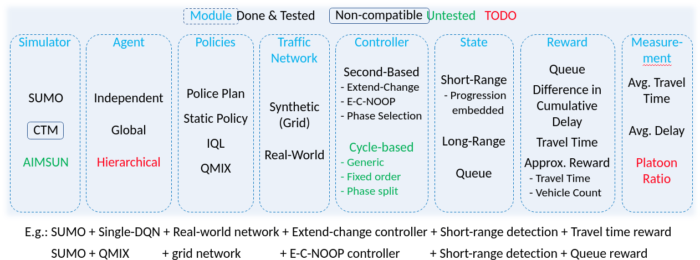

Design philosophy
=================

Composition Design Pattern
^^^^^^^^^^^^^^^^^^^^^^^^^^

Everything is customisable: metrics, algorithms, controller, observation, simulator. To operate this, the architecture is designed following a composition pattern (instead of Hierarchical).

TrafficEnv is a gym/rllib/flow environment that combines different components. Most of the components can be found under wolf/world/environments/agents/connectors. But also in agent_factory.

In env_factories.py, you have a collection of prefabricated environments. You can choose the env you want by specifying “"env": "test2" under the “config” key of your Ray experiment. The env key must exist in the registry (wolf/utils/configuration/registery.py)

Not that CTMEnv is unchangeable (or very lightly).

One Configuration File to Rule Them All
^^^^^^^^^^^^^^^^^^^^^^^^^^^^^^^^^^^^^^^

All the parameters can be specified in a configuration file (yaml or json). This file followed the same structure as any Ray configuration file. This is under “env_config” that you can compose your TrafficEnv (choosing the simulator, the action space etc). Like in Ray, you can add a “grid_search” entry as a parent of any key, in order to operate different simulations. A list must be under gridsearch. For example:

.. code-block:: yaml

    “a”:
        “gridsearch”:
            - “hello”: “world”
            - “hello2”: “world2”

This config means the parameter “a” will be instantiate two times, one with  {“hello”: “world”} and the other time with {“hello2”: “world2”}.

The test configuration files work with ray (see the key "ray" in the config file), if you decide to use another RL library,
you will need to decide your own config file structure, but you
can keep everything under "general" and reuse everything under "env_config" (which are agnostic to the RL framework).