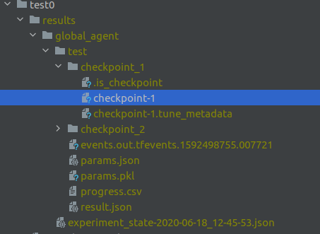

Scripts
=======

All script are under wolf/scripts.

The main script
^^^^^^^^^^^^^^^

main.py is the core script. It runs a configuration file with Ray as RL backend.

.. code-block:: sh

    python main.py configs/main.yaml

We provide some tests under wolf/tests. Tests come as configuration file,
so there is nothing to do beside calling main.py with the path of the test file, for example

.. code-block:: sh

    python main.py ../tests/traffic_env/test0/global_agent.yaml

See the :ref:`configuration file<config_file_example>` example for more details.

Master plot
^^^^^^^^^^^

If you did multiple experiments, and you want to plot everything on the same image. You can call the following script.

.. code-block:: sh

    python master_plot.py --config example_plot.yaml

In the yaml file, you just need to specify the experiment folders and the color of each curve.

You can also choose what RLlib metric you want to compare under the metrics key. Metrics are the one displayed on tensorboard.

For example:

.. code-block:: yaml

    "max_x": 25 # the x axis upper bound
    "experiments":
      "global_agent":
        "path_results": "/home/ncarrara/ray_results/global_agent_night_run" # path of the experiment folder.
        "color": "blue"
      "random":
        "path_results": "/home/ncarrara/ray_results/random"
        "color": "red"
    "metrics":
      "eps-greedy":
        "path": ["episode_reward_mean"] # Ray's metric "path", meaning the key in the result file produced by Ray.
      "greedy":
        "path": ["evaluation", "episode_reward_mean"] # This one mean evaluation/episode_reward_mean.

Merge experiments
^^^^^^^^^^^^^^^^^

You can create multiples configs files with just one experiment by file (Ray's experiment). For example, dqn.yaml, and qmix.yaml:

.. code-block:: yaml

    "ray":
      "run_experiments":
        "experiments":
          "dqn":
            ...

.. code-block:: yaml

    "ray":
      "run_experiments":
        "experiments":
          "qmix":
            ...

That way you can run those experiments individually. If you want to run all those experiments at the same time, you can call the following script:

.. code-block:: sh

    python merge_and_run_experiments.py --files path/to/file.yaml path/to/file2.yaml --sumo_home /home/user/sumo_binaries/bin --workspace tmp

It will merge the config files into a single one:

.. code-block:: yaml

    "ray":
      "run_experiments":
        "experiments":
          "dqn":
            ...
          "qmix":
            ...

And ray will run each of those single experiment (sequentially or in parallel). This is particularly useful if you want to debug experiments individually,
and compare all of them with a single run (without having to copy paste everything).

Visualisation
^^^^^^^^^^^^^

When your policy is being optimised, Ray will save on the disk the model. You can visualise the greedy policy using this script:

.. code-block:: sh

    python rollout.py --checkpoint /where/the/checkpoint/is/save --run APEX --env “traffic_env_test2” --video_dir /path/to/save/video --no_render

This script is just an extension of the rollout script from RLLib, tailored to use our custom environments (TrafficEnv and CTMEnv)

Usually the checkpoint is saved under the name of the experiment, under your workspace (specified in the config file), for example:

In that case, the checkpoint path should be:

.. code-block:: sh

    tests/traffic_env/test0/results/global_agent/test/checkpoint_1/checkpoint-1

You must also make sure the "--run" arguments match the algorithm you used with RLLib to learn the policy.

The argument "--env" describe the entry of environment in the registry. It must correspond to the environment you use for learning.

Cf the registry for environment keys:

.. code-block:: python

    R.register_env_factory("simple_grid", simple_grid)
    R.register_env_factory("generic_grid", generic_grid)
    R.register_env_factory("grid_master_slaves_3", lambda config: grid_master_slaves(config, 3, 300))
    R.register_env_factory("grid_gaussian_master_slaves_4", lambda config: grid_gaussian_master_slaves(config, 4, 300))
    R.register_env_factory("traffic_env_test0", test0)
    R.register_env_factory("traffic_env_test0_1", test0_1)
    R.register_env_factory("traffic_env_test1", test1)
    R.register_env_factory("traffic_env_test2", lambda config: grid_master_slaves(config, 4, 300))
    R.register_env_factory("real_world_network", real_world_network)
    R.register_env_factory("default_ctm", lambda config: CtmEnv.create_env(CtmEnv,**config))
    R.register_env_factory("ctm_test1", lambda config: ctm_test1(config))
    R.register_env_factory("ctm_test2", lambda config: ctm_test2(config))
    R.register_env_factory("ctm_test0", lambda config: ctm_test0(config))
    R.register_env_factory("ctm_test0_1", lambda config: ctm_test0_1(config))
    R.register_env_factory("ctm_test3", lambda config: ctm_test3(config))
    R.register_env_factory("ctm_test4", lambda config: ctm_test4(config))
    R.register_env_factory("ctm_test5", lambda config: ctm_test5(config))

Miscelaneous scripts
^^^^^^^^^^^^^^^^^^^^

Check is sumo is installed. If not, you might need to specify the sumo path in the configuration file, under “general”, or in scripts arguments.

.. code-block:: sh

    python test_sumo.py

Check how the ray handles epsilon greedy decaying.

.. code-block:: sh

    python vizu_exp_schedule.py
